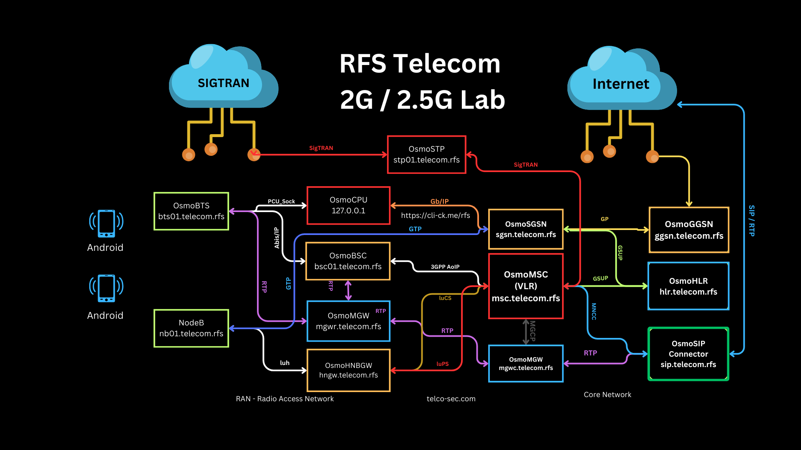

# GSM NiaB by RFS

This project aims to build a functional GSM network from scratch, enabling users to make and receive calls and access the internet using standard GSM mobile phones. \
The network will be built using open-source software and readily available hardware, making it an accessible and educational project for anyone interested in telecommunications.

### Features

- Call Functionality: Make and receive voice calls between GSM phones connected to the network.
- Internet Access: Provide internet connectivity to devices on the network.
- Open Source: Utilize open-source software like OpenBTS and Asterisk for flexibility and customization.
- Educational: Learn about GSM network architecture, protocols, and implementation.

### Limitations
LimeSDR only allow SISO for MIMO use BladeRF

### Hardware

- LimeSDR + Antennas
- GSM Phones (unlocked)
- SIM Cards
- RPI4 8GB + 1TB NVME

## Goals

1. Successfully establish a GSM network with basic call functionality.
2. Provide internet access to devices on the network.
3. Explore advanced features like SMS messaging and call routing.
4. Document the process to make it reproducible for others.

## Contributing

Contributions to this project are welcome! 
Feel free to submit pull requests for bug fixes, feature enhancements, or documentation improvements.

## OS
1. Debian 12 RPI4
2. Linux RPI4-GSM-B0x 6.6.31+rpt-rpi-v8 #1 SMP PREEMPT Debian 1:6.6.31-1+rpt1 (2024-05-29) aarch64 GNU/Linux

## Installation - In Dev

1. Install in Debian 12 - no GUI
2. Download my Image Ready for RPI4

## Osmocom Versions
- OsmoCBC version 0.5.0
- OsmoHLR version 1.8.0
- OsmoBTS version 1.8.0
- OsmoTRX version 1.7.0
- OsmoBSC version 1.12.1
- OsmoMSC version 1.12.1
- OsmoMGW version 1.13.1
- OsmoSTP version 2.0.1
- OsmoSGSN version 1.12.1
- OsmoGGSN version 1.12.0

## LimeSDR Info

rfs@2g-b0x:~ $ LimeUtil --info

- Library version:      v23.11.0-23.11.0
- Build timestamp:      2023-11-20
- Interface version:    v2023.11.0
- Binary interface:     23.11-1

- 
## Configuration
- 2 SIM cards provisioned to our network
- 1 BTS
- GSM Core - OSMO
- PBX Asterix
- Internet Connection

## Console Access

1. telnet 127.0.0.1 4264 - CBC
2. telnet 127.0.0.1 4258 - HLR
3. telnet 127.0.0.1 4242 - BSC
4. telnet 127.0.0.1 4241 - BTS
5. telnet 127.0.0.1 4237 - OsmoTRX
6. telnet 127.0.0.1 4254 - OsmoMSC

## Learn Telecom
- https://gsm.learn-telecom.com
- https://ss7.learn-telecom.com
- https://diameter.learn-telecom.com
- https://isdn.learn-telecom.com
- https://sim-cards.learn-telecom.com
- https://gtp.learn-telecom.com
- https://sip.learn-telecom.com
- https://ims.learn-telecom.com
- https://mobiles.learn-telecom.com

